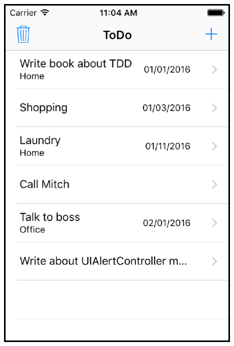
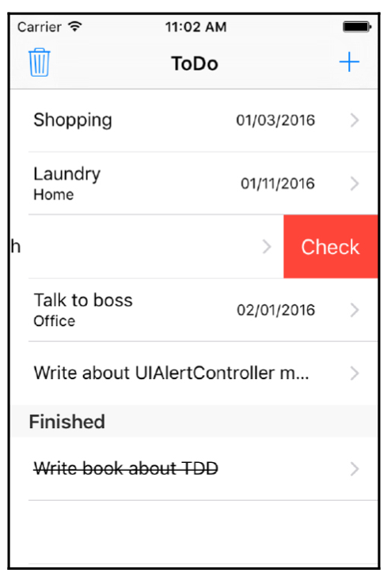
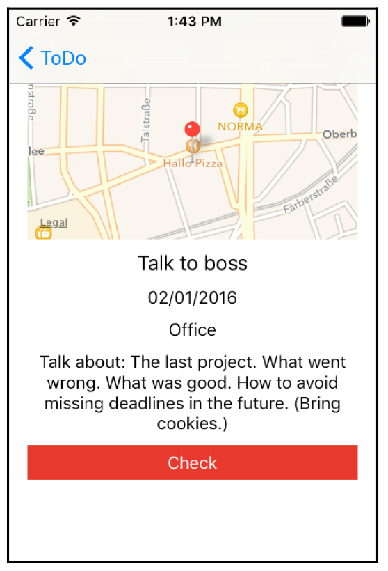
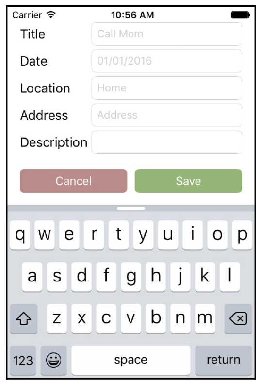
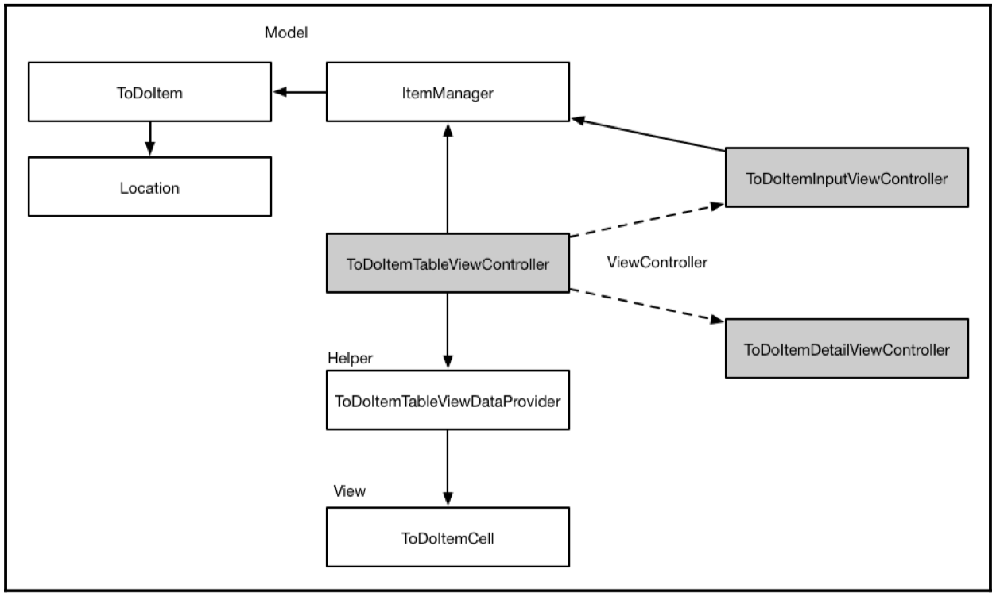

# Planning and Structuring Your Test-Driven iOS App

TDD에서, 테스트를 작성하는 동안에는 실제 코드에 대해서는 생각하지 않아야 한다. 테스트 할 '단위 코드'가 그것을 어떻게 수행할 지가 아닌 무엇을 해야 하는지를 설명해야 한다. 테스트를 깨지 않은 채로 구현을 변경할 수 있어야 한다. 

이를 연습하기 위해, 책의 남은 부분에서 간단한 to-do 리스트 앱을 개발할 것이다. 이 앱은 의도적으로 지루하고 쉽다. 복잡한 구현이 아닌 TDD 워크플로에 집중하길 바란다. 흥미로운 앱은 이 책의 중요한 점 즉, TDD 하는 법에서 관심을 분산하게 만들 것이다.

이 장에서는 우리가 만들 앱이 최종적으로 어떻게 보이는지 알려줄 것이다.

> The task list view  
> The task detail view  
> The task input view  
> The structure of an app  
> Getting started with Xcode  
> Setting up useful Xcode behaviors for testing  

### The task list view 

앱을 시작하면, todo 아이템들을 볼 수 있다. 아이템은 제목있고, 위치와 마감일이 옵션이다. `(+)` 버튼을 눌러서 새 아이템을 추가할 수 있다. 버튼은 네비게이션 바에 있다.

*User stories*

- 앱을 열면 todo 아이템 목록을 보고 싶다.
- todo 아이템을 추가하고 싶다.

todo 리스트 앱에서 사용자는 아이템이 완료되면 체크하는 것을 분명히 원할 것이다. 체크된 아이템은 체크 안 된 아이템 밑에 있고, 다시 체크를 취소하는 것도 가능하다. `UITableView`의 delete 버튼을 이용해서 체크하거나 체크를 취소할 수 있다. 체크된 아이템은 `Finished` 헤더를 가진 섹션의 끝에 붙어야 한다. 사용자는 쓰레기 모양 버튼을 눌러 아이템을 지울수도 있다. 

*User stories*

- todo 아이템을 완료한 것으로 체크할 수 있다.
- 체크 안 된 아이템들 밑에서 모든 체크된 아이템들을 볼 수 있다.
- 체크를 취소할 수 있다.
- 모든 아이템들을 지울 수 있다.

하나의 entry를 탭하면 entry에 대한 상세 내용을 detail view에서 볼 수 있다.

The task detail view

디테일뷰는 todo 아이템에 저장된 모든 정보를 보여준다. 제목, 마감일, 장소(이름과 주소) 그리고 설명으로 이루어져 있다. 주소가 주어진다면, 해당 주소에 대한 지도가 보인다. 디테일뷰에서도 아이템을 끝난 것으로 체크할 수 있다. 

*User stories*

- todo 아이템을 텝하면 디테일을 보고 싶다.
- 디테일 뷰에서도 체크하고 싶다.

The task input view

리스트 뷰에서 (+) 버튼을 누르면 태스크 작성뷰가 뜬다. 사용자는 태스크에 대한 정보를 입력할 수 있다. 제목을 필수다. `Save` 버튼은 제목이 주어져야 선택할 수 있다. 리스트에 이미 있는 태스크는 추가할 수 없다. `Cancel` 버튼을 누르면 뷰가 닫힌다.

*User stories*

- (+) 버튼을 탭 했다면, todo 아이템의 상세정보를 입력할 수 있는 폼을 보고 싶다.
- `Save` 버튼을 눌러 아이템을 저장하고 싶다.

수정과 삭제 기능을 구현하지 않을 것이다. 책 전체를 봤다면, 쉽게 스스로 테스트를 작성하고 기능을 추가할 수 있을 것이다.

보이는 것과 디자인은 테스트 하지 않을 것이다. 단위 테스트로 앱의 생김새가 의도한 대로 보이는 지를 확인할 수 없다. 단위 테스트는 보이는 것과 독립적인 기능을 테스트할 수 있다. 원칙적으로 UI 요소의 위치와 색에 대한 단위테스트를 작성할 수 있어야 한다. 하지만 이들은 개발 초기 단계에서 자주 바뀐다. 버튼 위치가 10 포인트 이동해서 실패하는 테스트를 작성하지 않을 것이다.

The structure of the app

The Table View Contorller, the delegate, and the data source

테이블 뷰는 보통 테이블뷰의 data source와 delegate 이기도 한 `UITableViewContoller`로 표시된다. 매우 많은 것을 하기 때문에 종종 무거운 Table View Controller 가 된다. view를 보이고, 다른 뷰컨트롤러로 이동하고, 테이블뷰에 보이는 데이터를 관리하는 등.

몇 개의 클래스로 책임을 나누는 것이 좋은 방법이다. 그래서 테이블뷰의 data source와 delegate 역할을 수행하는 helper 클래스를 사용할 것이다. 프로토콜을 이용해 Table View Contorller와 helper 클래스의 상호작용을 정의할 것이다. 프로토콜은 클래스의 인터페이스를 정의한다. 이것은 큰 장점이다. 만약 구현을 더 나은 버전으로 교체해야 할 때, 깨끗한 인터페이스에 맞춰서 개발하면 된다. 다른 클래스의 내부 동작은 중요하지 않다.

Table view cells
생략

The model

앱의 모델은 todo 아이템, 위치 그리고 아이템에 대한 추가 및 삭제와 아이템을 관리하는 매니저로 이루어진다. 그래서 컨트롤러는 매니저에게 아이템을 보여줄 것을 요청해야 한다. 아이템 매니저는 아이템을 저장하는 역할 또한 수행할 것이다.

초심자는 종종 컨트롤러에서 모델 객체를 관리하는 경향이 있다. 그러면 컨트롤러는 아이템 컬렉션에 대한 참조를 갖게 되고, 추가 및 삭제도 컨트롤러에서 이루어진다. 이는 추천되지 않는다. 만약 아이템의 저장소를 바꾸려고 한다면 그들에 대한 추가 및 삭제가 컨트롤러 내에서 변경되어야 한다. 클래스의 overview를 유지하기 어렵고, 이러한 이유 때문에 버그들의 원인이 된다.

만약 모델 객체의 관리 방법을 바꿔야 해도 컨트롤러는 그대로 놔두면 되기 떄문에, 컨트롤러와 모델 객체 간의 깨끗한 인터페이스를 가지는 것이 훨씬 쉽다. 인터페이스를 그대로 유지한다면, 모델 레이어 전체를 교체할 수 있다. 이 장의 마지막에서 이러한 분리가 테스트를 더 쉽게 만드는 것을 볼 것이다.

Other View Controllers 

앱은 두 개의 뷰 컨트롤러를 가질 것이다. 디테일 뷰 컨트롤러와 태스크 입력을 위한 뷰 컨트롤러

사용자가 리스트의 아이템을 탭하면, 아이템에 대한 상세 정보가 task detail view controller 에서 보일 것이다. `Detail` 스크린에서 유저는 아이템을 체크할 수 있을 것이다.

input view controller를 이용해 새 todo 아이템이 리스트에 추가될 것이다.

The development strategy

안에서 밖으로 개발할 것이다. 모델에서 시작, 컨트롤러를 만들고, 컨트롤러를 만들 것이다. 책의 마지막에서 모두를 함께 모을 것이다.

당연히 이는 앱을 만드는 유일한 방법이 아니다. 기능이 대신 기본적인 레이어로 나누면 일어날 일에 대한 overview를 따르고 유지하기 쉽다. 추후에 필요한 관련 정보를 찾기 쉽다.

Getting started with Xcode 
생략